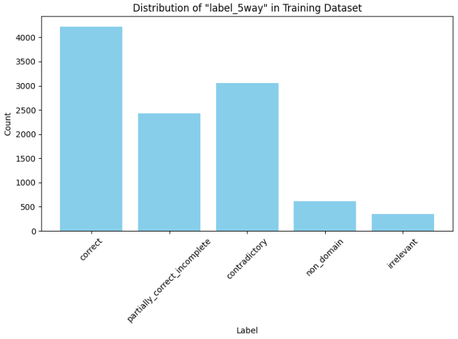
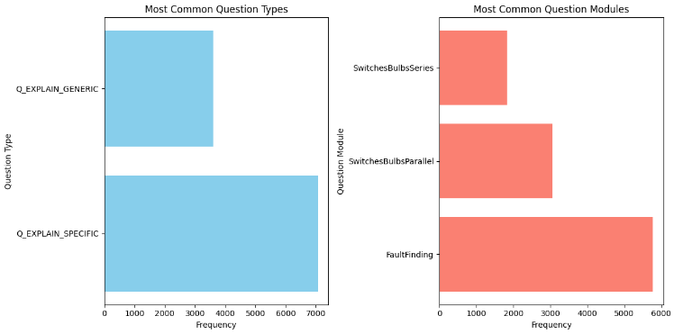

# Automated Short Answer Grading Experiment

## Objectives
The task is to build, train, and evaluate a machine learning model for ASAG to achieve:
- High grading accuracy
- Robustness to linguistic challenges common to NLP tasks

## Getting Started

### Requirements
- Python 3.11
- Poetry for dependency management

### Setup
1. **Install Poetry:**
   - Install Poetry if it's not already installed:
     ```bash
     curl -sSL https://install.python-poetry.org | python3 -
     ```

2. **Setup the Python environment using Poetry:**
   - Activate the poetry shell and install dependencies:
     ```bash
     poetry shell
     poetry install
     ```

3. **Environment Variables:**
   - Copy the example environment file and set the required environment variables:
     ```bash
     cp env.example .env
     ```
   - Open the `.env` file and fill in the `OPENAI_API_KEY` with your OpenAI API key.

### Running the Application
- To run the application, use the following command:
  ```bash
  python -m src.asag.main "because the path was closed" "Bulb A is still contained in a closed path with the battery" "Why was bulb A on when switch Y was open and switch Z was closed?"
  ```

## Data
For this experiment, we utilized Atomi’s public version of the open-source SemEval 2013 Task 7 dataset:
[Atomi/semeval_2013_task_7_beetle_5way · Datasets at Hugging Face](https://huggingface.co/datasets/Atomi/semeval_2013_task_7_beetle_5way).
The dataset contains approximately 12,000 examples of question, reference answer, and student answer triples graded by domain experts.

### Label Definitions
From [the paper](https://aclanthology.org/S13-2045.pdf), labels are defined as:
- **Correct**: The student answer is a complete and correct paraphrase of the reference answer.
- **Partially correct incomplete**: The answer is partially correct, containing some but not all information from the reference answer.
- **Contradictory**: The student answer explicitly contradicts the reference answer.
- **Irrelevant**: The student answer discusses domain content but does not provide the necessary information.
- **Non domain**: The student utterance does not include domain content, e.g., "I don’t know", "what the book says", "you are stupid".

These definitions were useful to add to the instruction prompt.

## Exploratory Data Analysis Key Takeaways (see [EDA.ipynb](./notebooks/EDA.ipynb) for details)
- **Answer Quality**: We will use the BEST quality answers for training as they are plentiful and the label distribution is consistent with the MINIMAL quality answers.
- **Question Filtering**: We will not filter out poorly formulated questions. The model's primary function is to assess answers by comparing them directly to the reference answers, which should mitigate the impact of question quality.
- **Label Distribution**: The distribution of labels such as "irrelevant" and "non_domain" is sparse. Future improvements could focus on enhancing the representation of these labels.

- **Question Uniqueness**: Each question in the dataset is unique, tailored to its specific model.
- **Question Types**: There were 2 question types and 3 question modules


## Methodology

### Considerations
Initially, I considered two primary approaches for our model architecture.

**Option 1**:
Using a transformer pre-trained on Natural Language Inference (NLI). In NLI, the task is to determine if the premise entails the hypothesis, if they are contradiction or if they are neutral, which is very relevant for ASAG.

An example methodology is described [here](https://sbert.net/examples/training/nli/README.html#softmaxloss) where a softmax classifier sits over a siamese network to predict between "entailment", "neutral" and "contradiction". 

Because of the time constraint of this experiment, I didn't have time to train an encoder to reliably predict between 5 labels.

**Option 2**:
The other option was to utilize a Large Language Model (LLM). LLMs possess extensive world knowledge, enabling them to reason across multiple domains. This capability is crucial for addressing the diverse and open-ended nature of student responses in ASAG, particularly given the challenge of a lack of domain-specific data.
Initially, I planned to use the Llama 3 8B parameter model on local to cut development expenses. However, it proved too slow for our needs, leading us to opt for the GPT-3.5 Turbo model instead, which offered the necessary speed.

**After careful consideration, I opted to go with Option 2 and use an LLM.**

## Results (see [training_model.ipynb](./notebooks/training_model.ipynb) for details.)

### Data Preprocessing
- Selected "BEST" reference answer quality for consistency.
- Limited the dataset to 60 examples per label to manage costs and training time, resulting in a total training dataset of 300 examples. Out of a possible 10,670 training examples.
- Only chose `question, student_answer, reference_answer` as the relevant features
```
dspy_dataset_equal_distribution = [
    dspy.Example(
        question=example["question"],
        student_answer=example["student_answer"],
        reference_answer=example["reference_answer"],
        assessment=example["label_5way"]
    ).with_inputs("question", "student_answer", "reference_answer")
    for example in sampled_examples
]
```

### Model Building
- Developed a [DSPY](https://dspy-docs.vercel.app/docs/building-blocks/optimizers) pipeline with a Chain of Thought (CoT) approach.
CoT is a prompt engineering technique 
- Utilized BootstrapFewShotWithRandomSearch optimizer to select the best few-shot examples for the model's prompt.
- See [training_model.ipynb](./notebooks/training_model.ipynb) for training process details.
- See [grading_model.py](./src/asag/grading_model.py) for the final LLM pipeline structure in code.
- See [extracted_prompt.txt](./data/extracted_prompt.txt) for the optimised prompt. This is stored by DSPY in [this model config file](./notebooks/asag_cot_better_instruction_prompt.json) when `optimised_program.save()` is called.

### Metrics and Evaluation
The metric chosen was grading accuracy, measuring the percentage of correct feedback generated by the system against the ground truth.

```
def grading_accuracy_metric(example, predicted, trace=None):
    
    score = 1 if example["assessment"] == predicted["assessment"] else 0
    
    return score
```

With our `grading_accuracy_metric` defined before, I got the following results:

**Iteration 1:**
- Basic instruction prompt and was the first end to end test run

| Dataset        | Average Accuracy | Number of Examples |
|----------------|------------------|--------------------|
| Training Set   | 39.6%            | 210                |
| Development Set| 33.2%            | 90                 |
| Test Set       | 28.8%            | 296                |

**Iteration 2:**
- Improved instruction prompt with label definitions included
- Final run

| Dataset        | Average Accuracy | Number of Examples |
|----------------|------------------|--------------------|
| Training Set   | 42.9%            | 210                |
| Development Set| 36.7%            | 90                 |
| Test Set       | 32.8%            | 296                |

I had initally planned to run through the entire test set of 1489 examples, but had to cut it short due to the 4 hour time constraint and OpenAI API token limit.


## Error Analysis
- Lots of over labelling of "partially_correct_incomplete" class

## Concluding Remarks
### Strengths
- Choice of using LLM enabled us to have good reasoning capability and it has massive potential for performance improvement.
- State-of-the-art techniques (in DSPY) used to create the LLM pipeline using the most popular project from Stanford NLP lab.
- Implementation of a cost-effective solution with a reasonable baseline accuracy in 4 hours.
- We can control the structure of the LLM pipeline and prompts using DSPY.

### Weaknesses
- Limited data used for training might not fully capture the complexity of the task.
- We are reliant on the framework developed by DSPY. And the documentation of it is not the best. But with more time we can overcome this by implementing parts of this in house.
- "question" column in training set not containing the full question hinders the ability of the model to reason as well.
- Sparse labels for "irrelevant" and "non_domain" could lead to biases in model predictions.
- The final pipeline is slow to run because of the LLM. It was also very slow to train.

### Opportunities
- With more time and resources, integrating more comprehensive data and employing advanced models like GPT-4-turbo could enhance the model's performance.
- Further optimization of the instruction prompt and exploration of traditional NLP entailment methods could improve accuracy.
- Incorporating the content of relevant coursework/study material into the model using a RAG (Retrieval Augmented Generation) system to provide necessary context.
- Experimenting with [MIPRO (Multi-prompt Instruction Proposal Optimizer)](https://github.com/stanfordnlp/dspy/blob/9c1fff94bb48b55a2ddaab5ce8c23f7ad3af61e3/dspy/teleprompt/mipro_optimizer.py) and higher temperature settings to optimize the instruction prompt.
- Utilizing a higher budget to employ GPT-4 turbo for data generation and to teach/finetune smaller, more efficient models such as Llama and Mistral, following a progression from GPT-4 to T5.
- Pre-training a large language model on ASAG/SRA corpus to better tailor the model's understanding to the specific domain.
- Developing more nuanced metrics that weight different errors differently, particularly emphasizing the discrimination between "correct" and other labels.
- Using the full training dataset to fine-tune the model and explore traditional NLP entailment methods further.
- Training a local T5 Model (770M parameters) using the DSPY framework, which [has shown success in tasks like HotPotQA with only 200 labeled answers](https://x.com/lateinteraction/status/1712135660797317577), without the need for hand-written prompts, OpenAI calls, or labels for retrieval or reasoning.
